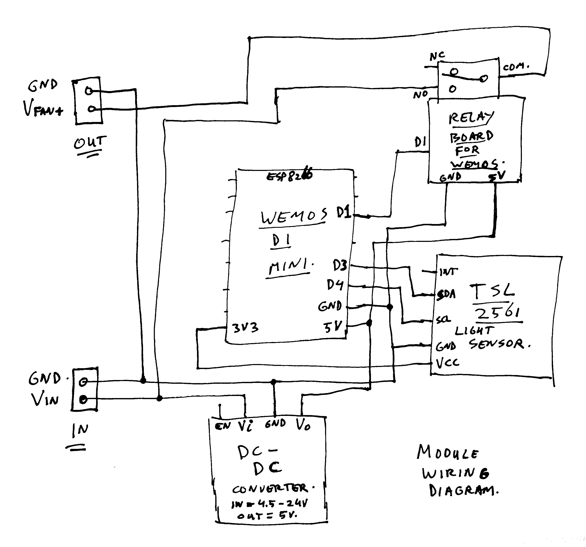

# ESP8266 Light Triggered Fan Timer

See also blog post: https://www.kaper.com/electronics/light-triggered-fan-timer/

See some images in the images folder, and the source code in the FanTimer folder.

Just open the source using the ArduinoIDE, make sure to install ESP8266 board support.
And add some needed libraries. See the includes at the top to find which ones.

Sorry, did not feel like writing a big readme today. Maybe I will update it later ;-)

Thijs, March 13, 2021.

